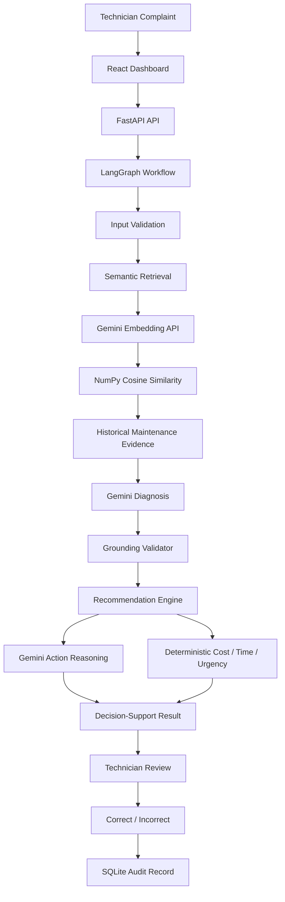

# 🏢 Campus Maintenance Agent

> **From maintenance complaints to evidence-backed decisions.**

**Campus Maintenance Agent** is an AI-powered decision-support system for campus and facility teams.  
Instead of starting every breakdown from scratch, it searches historical maintenance knowledge, reasons over the retrieved evidence, recommends an action, estimates operational impact, and records technician feedback.

<div align="center">

### 🚀 Live Product
**[Open Campus Maintenance Agent →](https://campus-maintenance-agent.vercel.app/)**

**[Backend Health →](https://campus-maintenance-agent.onrender.com/health)** · **[API Docs →](https://campus-maintenance-agent.onrender.com/docs)** · **[GitHub →](https://github.com/Mr-C-Tejesh/campus-maintenance-agent)**

</div>

---

## 🎯 The problem

When an AC stops cooling, a generator behaves abnormally, or an elevator develops a fault, facility teams often depend on technician memory or manually search old maintenance records.

That creates three practical problems:

**⏱ Slower diagnosis** — useful historical cases are difficult to find quickly.  
**🔁 Repeated failures** — earlier fixes and root causes can be overlooked.  
**📉 Inconsistent decisions** — recommendations depend heavily on who is handling the complaint.

### The idea

> **Give a new complaint the context of what happened before.**

---

## ⚡ What the agent does

A technician enters a complaint such as:

> *“AC is running continuously but the room remains warm.”*

The system then:

```text
Complaint
   ↓
Validate input
   ↓
Semantic retrieval
   ↓
Retrieve similar maintenance cases
   ↓
Gemini diagnosis
   ↓
Evidence / grounding validation
   ↓
Repair recommendation
   ↓
Historical cost + repair-time estimate
   ↓
Deterministic urgency assessment
   ↓
Technician review
   ↓
Correct / Incorrect feedback
```

The result is not just an LLM answer. It is a **traceable decision-support record** tied to retrieved maintenance evidence.

---

## 🧠 Architecture



### Workflow orchestration

LangGraph keeps the core flow explicit and inspectable:

```text
START
  ↓
retrieve
  ↓
diagnose
  ↓
recommend
  ↓
END
```

The architecture is deliberately lightweight: each component has a clear responsibility rather than hiding the whole workflow behind a single prompt.

---

## 🔎 Semantic retrieval

The retrieval layer was designed around a simple constraint: **keep semantic search without requiring a heavy local ML runtime on a small cloud instance.**

### Current retrieval design

- **Embedding model:** `gemini-embedding-001`
- **Document embeddings:** precomputed from the maintenance archive
- **Query embeddings:** generated on demand for each complaint
- **Similarity:** cosine similarity implemented with NumPy
- **Default top-k:** 5
- **Relevance threshold:** cosine distance ≤ 0.75
- **Dataset:** 250 synthetic maintenance records
- **Equipment covered:** Air Conditioning, Generator, Elevator

Historical records are converted into searchable documents using fields such as equipment type/model, location, maintenance type, complaint, symptoms, root cause, and action taken.

The index stores the embedding alongside the original case metadata, so a retrieved vector always maps back to a concrete maintenance case.

### Why the architecture changed

The first prototype used a local Sentence Transformers + ChromaDB stack. On Render's free 512 MB environment, the local embedding runtime exceeded the memory budget.

The retrieval interface was therefore kept stable while the implementation was changed to:

```text
Precompute document embeddings once
          ↓
Persist embedding matrix + metadata
          ↓
Generate one query embedding per request
          ↓
NumPy cosine similarity
          ↓
Top-k historical cases
```

This removed the heavyweight Torch / transformer runtime from the production process while preserving semantic retrieval.

---

## 🧩 Evidence-grounded diagnosis

The diagnosis stage uses **Gemini** to reason over:

1. the current complaint
2. the selected equipment context
3. retrieved historical maintenance cases

The model returns structured information such as:

- diagnosis summary
- possible causes
- likelihood
- supporting case IDs
- evidence
- reasoning
- confidence
- technician checks

### Grounding safeguard

The model is **not trusted blindly**.

Supporting case IDs are validated against the cases actually retrieved for that workflow.

If useful historical evidence is unavailable, the system can fall back to an **inspection-first, low-confidence response** rather than pretending that an unsupported diagnosis is evidence-backed.

---

## 🛠 Recommendation engine

The recommendation stage deliberately separates **language generation** from **operational calculation**.

### Gemini handles

> Technician-friendly recommended action and reasoning.

### Deterministic application logic handles

| Signal | Method |
|---|---|
| Repair cost | Historical min / max / median |
| Repair time | Historical min / max / median |
| Urgency | Rule-based signals + retrieved urgency + diagnosis confidence/likelihood |

This separation makes numeric outputs easier to reproduce, test, explain, and defend during technical review.

---

## 👷 Technician feedback loop

Every analysis receives a server-generated workflow ID.

A technician can record:

**✓ Correct**  
**✕ Incorrect**

and optionally add notes.

The audit record stores the workflow context, including complaint, equipment type, location, retrieved case IDs, diagnosis, recommendation, feedback, timestamp, and notes.

> **Important:** feedback is currently used for operational auditing and future dataset curation. It does **not** automatically retrain Gemini or modify the embedding model.

---

## 🖥️ Product experience

The dashboard is designed like a practical facility-management tool rather than a chatbot.

### The operator sees

- complaint intake
- equipment and facility context
- retrieved historical evidence
- diagnosis and confidence
- supporting cases
- recommended action
- historical cost reference
- historical repair-time reference
- urgency
- technician verification checklist
- Correct / Incorrect review
- feedback history

The goal is simple:

> **Less searching. More context. Better documented decisions.**

---

## 🧪 Engineering safeguards

The system includes:

- input validation
- strict equipment-type validation
- retrieval relevance filtering
- evidence / case-ID grounding validation
- server-generated workflow IDs
- duplicate feedback protection
- safe no-evidence fallbacks
- environment-based secret configuration
- separate deterministic business logic
- lightweight cloud retrieval runtime

---

## 🧰 Tech stack

| Layer | Technology |
|---|---|
| Frontend | React 18 + Vite |
| Backend | Python + FastAPI |
| Orchestration | LangGraph |
| LLM | Google Gemini via `google-genai` |
| Embeddings | `gemini-embedding-001` |
| Vector math | NumPy |
| Persistence | SQLite |
| Hosting | Vercel + Render |

---

## 🌐 API

| Method | Endpoint | Purpose |
|---|---|---|
| `GET` | `/health` | Service health |
| `POST` | `/api/v1/analyze` | Run retrieval → diagnosis → recommendation |
| `POST` | `/api/v1/feedback` | Submit technician feedback |
| `GET` | `/api/v1/feedback?limit=50` | Retrieve recent feedback |

Example request:

```json
{
  "complaint": "AC is running continuously but the room remains warm",
  "equipment_type": "Air Conditioning",
  "location": "Laboratory Block",
  "top_k": 5
}
```

---

## 💻 Run locally

### 1. Backend

```bash
python3 -m venv venv
source venv/bin/activate
pip install -r requirements.txt
cp .env.example .env
```

Configure:

```env
GEMINI_API_KEY=your_actual_key
GEMINI_MODEL=gemini-3.6-flash
```

Start:

```bash
python3 run.py --server
```

Backend:

```text
http://localhost:8000
```

Swagger:

```text
http://localhost:8000/docs
```

### 2. Frontend

```bash
cd frontend
npm install
npm run dev
```

Frontend:

```text
http://localhost:5173
```

For a hosted backend:

```env
VITE_API_BASE_URL=https://your-backend-url
```

### 3. Tests

```bash
./venv/bin/python3 -m unittest discover -s tests -p "test_*.py"
```

---

## ☁️ Deployment

### Backend — Render

```text
Runtime:        Python 3
Build:          pip install -r requirements.txt
Start:          uvicorn app.api.app:app --host 0.0.0.0 --port $PORT
```

Environment variables:

```text
GEMINI_API_KEY
GEMINI_MODEL
FRONTEND_ORIGIN
```

### Frontend — Vercel

```text
Framework:      Vite
Root directory: frontend
Build:          npm run build
Output:         dist
```

Environment variable:

```text
VITE_API_BASE_URL
```

The current demo is deployed using free hosting tiers.

---

## 📈 Verification

The current release was verified with:

- **97/97 Python tests passing**
- **Vite production build passing**
- live Render health check
- live semantic retrieval + diagnosis + recommendation workflow
- live technician feedback flow

The demo dataset contains **250 synthetic maintenance cases**.

---

## ⚖️ Limitations

This is a hackathon prototype, not a production CMMS.

- The maintenance archive is synthetic.
- The system is decision support, not autonomous repair.
- Local SQLite is suitable for the prototype, not a multi-instance production deployment.
- Diagnosis quality depends on historical coverage and retrieval quality.
- Production deployment would require managed persistence, authentication/RBAC, monitoring, stronger evaluation, and integration with real maintenance systems.

---

## 🔭 Future scope

```text
Real CMMS / work-order integration
        ↓
Managed PostgreSQL + pgvector
        ↓
Technician authentication + RBAC
        ↓
Evaluation & retrieval analytics
        ↓
Failure trend detection
        ↓
Multimodal evidence
(photos / meter readings / error codes)
```

The long-term direction is to make maintenance knowledge **searchable, explainable, and continuously auditable**.

---

## 📁 Project structure

```text
campus-maintenance-agent/
├── app/
│   ├── api/              # FastAPI routes and schemas
│   ├── data/             # Dataset loading and validation
│   ├── diagnosis/        # Gemini diagnosis + grounding
│   ├── feedback/         # Technician feedback + SQLite
│   ├── recommendation/   # Cost / time / urgency + action
│   ├── retrieval/        # Embedding + semantic search
│   └── workflow/         # LangGraph orchestration
├── data/
│   ├── maintenance_records.csv
│   └── gemini_embeddings.json
├── frontend/             # React dashboard
├── scripts/
│   └── build_embeddings.py
├── tests/
├── requirements.txt
└── run.py
```

---

## 🎬 One-line pitch

> **Campus Maintenance Agent retrieves what happened before, grounds AI reasoning in that evidence, and turns it into a documented maintenance decision.**

---

<div align="center">

**Built for the National AI Hackathon 2026**

Made with Python · FastAPI · LangGraph · Gemini · NumPy · React

</div>
